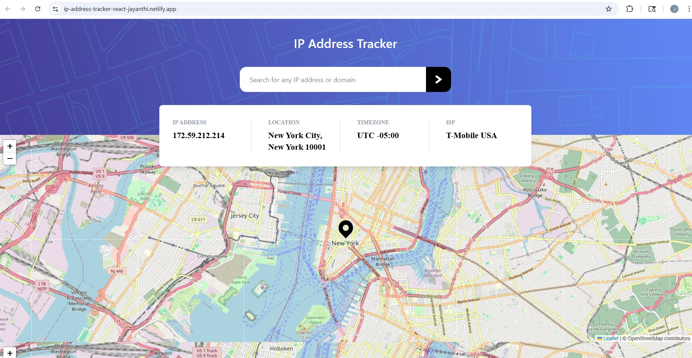

<h1 align="center">IP Address Tracker</h1>

A responsive React application that allows users to search for any IP address and view detailed location information along with an interactive map. The app fetches geolocation data from the Geo.IPify API and automatically shows the user’s current IP and location on initial load.

## Live Demo link: https://ip-address-tracker-react-jayanthi.netlify.app/



## Overview

The IP Address Tracker lets users enter an IP address and instantly retrieve information such as:
- Geographic location (city, region, postal code)
- Timezone
- Internet Service Provider (ISP)
The location is also displayed on an interactive map using Leaflet. The app is fully responsive for mobile, tablet, and desktop devices.

## Installation & setup

### Clone the repository:
````bash
git clone https://github.com/jayanthibs/ip-address-tracker-react-project.git
````
### Navigate to the project folder:
````bash
cd ip-address-tracker-react-project
````
### Install dependencies:
````bash
npm install
````
### Run the development server:
````bash
npm run dev
````
## Features
- Search for any IPv4 or IPv6 address
- Display IP address information including:
    - IP Address
    - Location (City, Region, Postal Code)
    - Timezone
    - Internet Service Provider (ISP)
- Interactive map displaying the IP location
- Input validation for IPv4 and IPv6 addresses
- Loading and error handling states
- Responsive design for mobile, tablet, and desktop
- Global state management using React Context API
- Custom React hooks for reusable logic

## Built With
- React
- JavaScript (ES6+)
- Vite
- Tailwind CSS
- React Leaflet
- Leaflet
- Geo.IPify API

## Project Structure
````text
src/
├─ assets/
│  └─ images/
│     ├─ pattern-bg-desktop.png
│     ├─ pattern-bg-mobile.png
│     └─ icon-location.svg
│
├─ components/
│  ├─ SearchIpAddress.jsx      # Main search input and form
│  ├─ DisplayIpAddress.jsx     # Card showing IP, location, timezone, ISP
│  └─ MyMap.jsx                # Interactive map component
│
├─ context/
│  └─ IpContext.jsx            # React Context API for global IP data state
│
├─ hooks/
│  ├─ useFetch.js              # Custom hook for API fetching
│  └─ useValidateIpAddress.js  # Custom hook for input validation
│
├─ App.jsx                     # Root component
└─ main.jsx                    # React application entry point

````

## How It Works

- The app loads and fetches the user's IP data automatically.
- The Geo IPify API returns the IP address, location, timezone, and ISP.
- The data is stored in global state using React Context API.
- The DisplayIpAddress component shows the IP details.
- The MyMap component displays the location on an interactive map.
- Users can search for another IP address using the search bar.
- The input is validated using the useValidateIpAddress hook.
- If valid, the app fetches new data from the API.
- The UI updates with the new IP information and map location.

## Key Concepts Demonstrated

- Custom Hooks: useFetch for API data fetching and useValidateIpAddress for validating user input.
- API Integration: Retrieving IP geolocation data from the Geo IPify API.
- State Management: Managing global IP data using React Context API along with useState.
- Responsive UI: Building a responsive layout with Tailwind CSS for mobile, tablet, and desktop screens.
- Map Integration: Rendering an interactive map and dynamic marker using React Leaflet and Leaflet.

## Environment Variables

Create a .env file in the root directory and add the Geo.IPify API key:
````bash
VITE_API_KEY=api_key_here
````

## Deployment

- The app is deployed on Netlify.
- To deploy:
    - Push the project to GitHub.
    - In Netlify, click New site from Git and connect the repo.
    - Set the build command: npm run build
    - Set the publish directory: dist
    - Click Deploy site.
- Netlify will automatically build and host the app, and future commits will trigger updates.

## Reflections

During the development of the IP Address Tracker, I built a responsive React application that allows users to search for any IP address and view detailed information, including location, timezone, ISP, and an interactive map. The project is structured into three main components: SearchIpAddress for input and validation, DisplayIpAddress for showing IP details, and MyMap for rendering the map. I also created custom hooks: useFetch for API requests and useValidateIpAddress for validating IPv4 and IPv6 addresses, keeping the code modular and clean.

A major challenge was managing layout and data fetching simultaneously, especially on smaller screens where the information card initially overlapped the map. I solved this using Tailwind CSS responsive grids and centering techniques (left-1/2 -translate-x-1/2). Another challenge was loading the user’s current IP on initial page load, which I addressed with React Context API, allowing global state management and smooth updates when new IPs are searched.

Potential improvements include adding search history, favorite IPs, enhanced map interactivity, and dark mode. Overall, this project strengthened my skills in React hooks, Context API, API integration, and responsive design, while teaching practical techniques for building clean, user-friendly, and modular web applications.